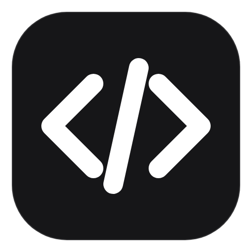
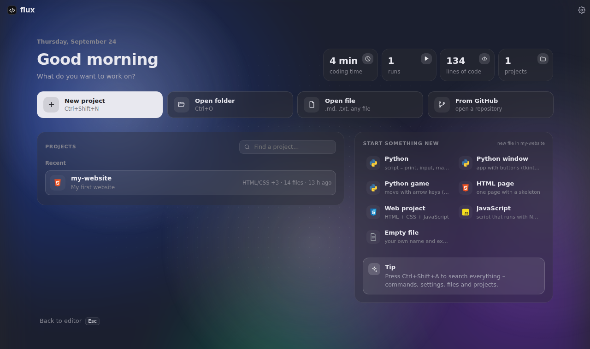
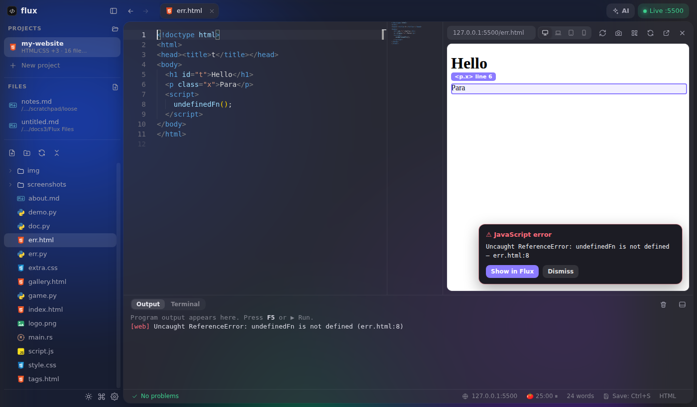
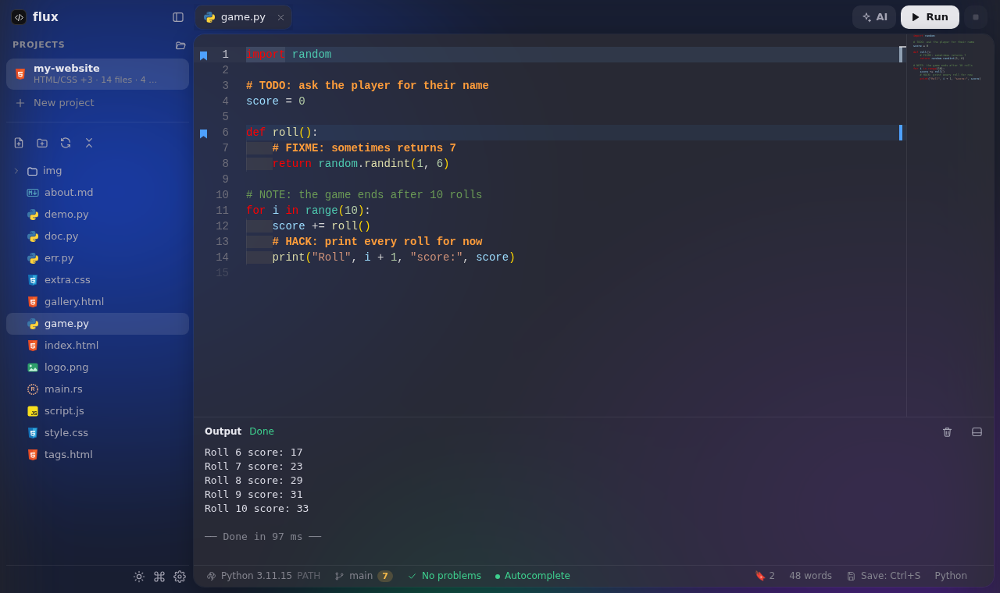
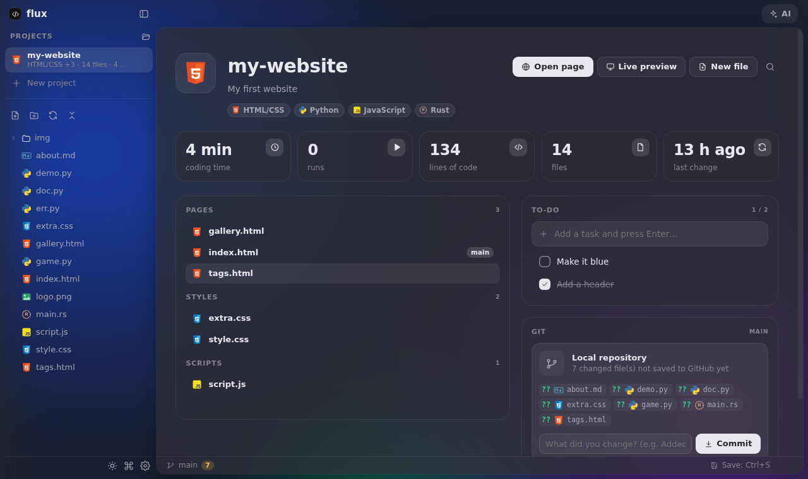
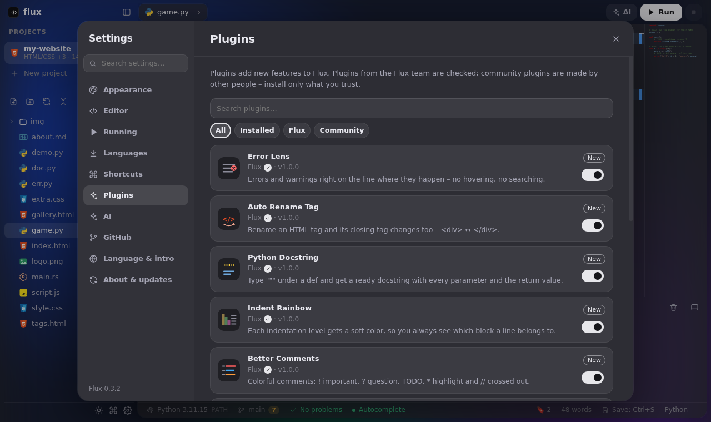

<p align="center">
  
</p>

<h1 align="center">Flux</h1>

<p align="center">
  A small, modern code editor for Windows 11 – run your code with one click, see websites live, get help from AI.
  <br><br>
  <a href="https://github.com/pantr1x/Flux/releases/latest"><b>Download for Windows</b></a>
  &nbsp;·&nbsp;
  <a href="CHANGELOG.md">What's new</a>
  &nbsp;·&nbsp;
  <a href="docs/PLUGINS.md">Make a plugin</a>
</p>

<p align="center">
  
</p>

## Install

1. Open the [latest release](https://github.com/pantr1x/Flux/releases/latest) and download `Flux-Setup-x.y.z.exe` under **Assets**.
2. Run it. Windows may show *"Windows protected your PC"* because Flux is not signed yet – click **More info → Run anyway**.
3. Flux keeps itself up to date: new versions download in the background and install when you close it (Settings → About & updates).

Programming languages are not bundled, so the installer stays small. Flux downloads only the ones you pick, from their official sources.

## What it does

| | |
|---|---|
|  **One-click Run** | Press **F5** to run Python, JavaScript, TypeScript, Java, C/C++, C#, Go, Rust, Ruby, PHP, Lua, Perl or shell scripts. `input()`, colors and windows (tkinter, turtle, pygame) work. Missing languages are installed for you. |
|  **Live Server** | A preview of your website right next to the code that reloads on save. **Alt+click** any element to jump to its line in the HTML, JavaScript errors show up on the page with a *Show in Flux* button, preview as laptop, tablet or phone (and rotate it), take a screenshot, or scan a QR code to open the page on your real phone. |
|  **Smart editor** | Autocomplete and error checking for Python (Pyright), HTML, CSS and JavaScript, Emmet, snippets, rename everywhere, auto-closing HTML tags, image previews on hover, Markdown preview. |
|  **Claude AI** | Ask Claude about your code (Ctrl+I) with your own API key. It can read your project and plan your to-do list. Flux also works the other way round: Claude Desktop, Claude Code and Cursor can use your Flux projects through MCP. |
|  **GitHub** | Sign in with GitHub, open any of your repositories as a project, commit and push, or publish a new project with one click. |
|  **Projects and files** | Projects with a description, to-do list and statistics (coding time, runs, lines). Open single files like `.md` or `.txt` without a project, or drop them onto the window. |
|  **Make it yours** | Code themes and a theme studio with live preview, accent colors, text and mouse cursor (also your own picture), fonts, app size, corners, background image, density (compact shows more) and focus mode (F11). 9 app languages: English, Slovak, German, Spanish, French, Italian, Polish, Portuguese and Ukrainian. |
|  **Keyboard first** | Every shortcut can be changed. Search everything with Ctrl+Shift+A, go back and forward with the mouse side buttons or Alt+←/→, run your own scripts from `shortcuts.json`. There is a real terminal next to the program output. |
|  **Plugins** | A plugin store with ratings and screenshots: Error Lens, Auto Rename Tag, Python Docstring, Indent Rainbow, Better Comments, CSS Class Completion, Bookmarks, Color Highlight, Snippet Pack, Word Count, **Theme Pack** (8 more color themes) and **Glass UI**. Plugins can add commands, snippets, styles and color themes – writing your own takes a few lines of JavaScript. GitHub is a built-in plugin you install when you need it. |

<p align="center">
  
</p>

<p align="center">
  
  
</p>

## Shortcuts

| Keys | Action |
|---|---|
| `F5` / `Shift+F5` | Run / stop |
| `Alt+L` | Live Server on / off |
| `Ctrl+Shift+A` | Search everything |
| `Ctrl+Shift+P` | Commands |
| `Ctrl+P` | Open a file of the project |
| `Ctrl+Alt+O` | Open any file |
| `Ctrl+I` | Claude AI |
| `Ctrl+Shift+V` | Markdown preview |
| `F11` | Focus mode – only the code |
| ``Ctrl+Shift+` `` | Terminal |
| `Alt+←` / `Alt+→` | Back / forward |
| `Alt+click` in the preview | Jump to that element in the HTML |
| `Ctrl+,` | Settings |

All of them can be changed in Settings → Shortcuts.

## Plugins

<p align="center">
  
</p>

Plugins live in [`plugins/`](plugins) and are installed from **Settings → Plugins**. To make your own, press **Create a plugin** there, or read the [plugin guide](docs/PLUGINS.md). Publishing is a pull request that adds your plugin folder.

## Build it yourself

```bash
npm install
npm start          # run Flux from the source
npm run dist       # build the Windows installer into release/
```

Flux is built with Electron, Monaco (the editor of VS Code), xterm.js and basedpyright.

A new version is released by raising `version` in `package.json` and adding its notes to `CHANGELOG.md` – GitHub Actions builds the installer and publishes the release, and installed copies update themselves.
